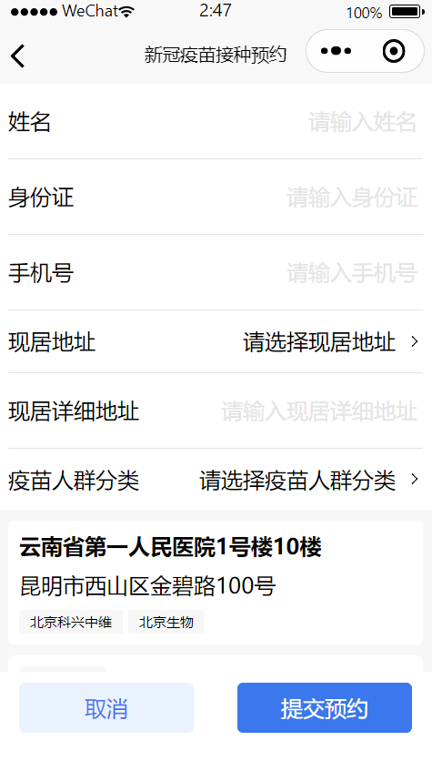
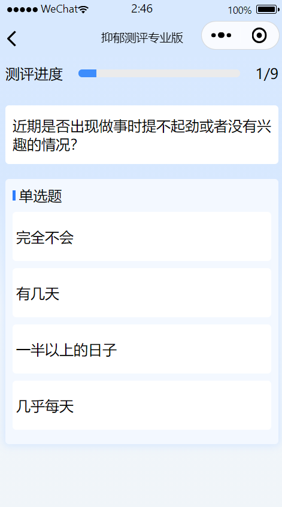

# Hospital Registration Mini-Program

[](https://github.com/Lxinyu1999/Ashiton.github.io)


This project is a UniApp-based Hospital Registration Mini-Program, designed to streamline the process of making medical appointments. The application simplifies patient access to hospital services, enabling appointment bookings across WeChat Mini Programs.

## Implementation

- UniApp: Cross-platform development framework for building applications on multiple platforms with a single codebase.
- Vue.js
- TypeScript
- Pinia: The state management library for Vue 3, offering a more flexible and lightweight approach than Vuex.
- Vite: Next-generation frontend build tool.
- Git & GitHub

## Highlights

- 🤖 Rich API Integration: Utilizes over 46 APIs from meituan.thexxdd.cn/api, supporting functionalities like COVID-19 vaccine appointments, HPV vaccine bookings, etc.
- ⚙️ Development Tools: Built using the WeChat Developer Tools for seamless integration with WeChat Mini Programs.
- 🌐 Cross-Platform Accessibility: Easily accessible both as a WeChat Mini Program and an H5 web application, facilitating broad user engagement.
- ✅ Skeleton Screen Setup: Implements skeleton screens for an enhanced user experience, providing immediate feedback to users during data loading processes.

## Getting Started

To set up the project locally, follow these steps:

```shell
# Install dependencies
git clone https://github.com/Lxinyu1999/hospital-registration-mini-program.git
cd hospital-registration-mini-program
npm install
```

```shell
# Run (wechat version)
npm run dev:%PLATFORM%

# For example, if you use wechat:
npm run dev:mp-weixin
```

## Display

### 🏠Homepage


### 📅Appointment of vaccine & Registration

 

### 🗳️Self-check



### 🔄Skeleton(Loading page)


### 🧑‍💻Login & Mypage


## 🙏Acknowledgement

Thanks to

- [DCloud and the UniApp Team](https://zh.uniapp.dcloud.io/tutorial/)
- [WeChat Developer Platform](https://open.weixin.qq.com/home)
